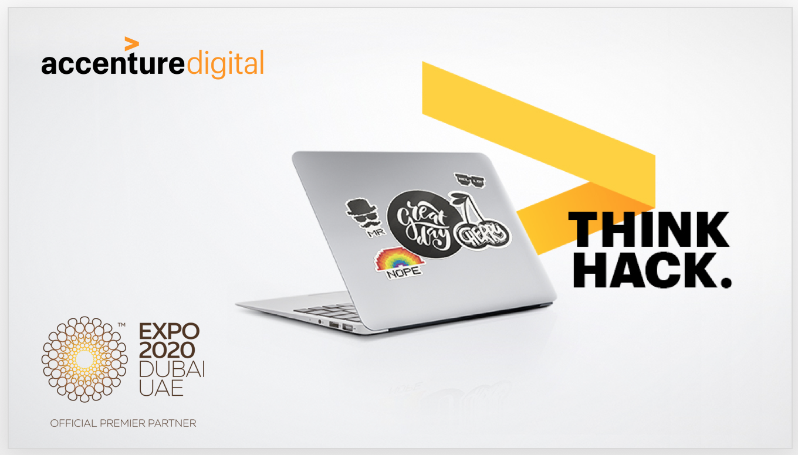
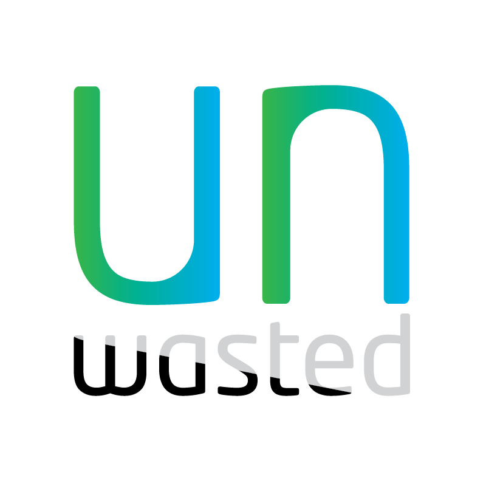
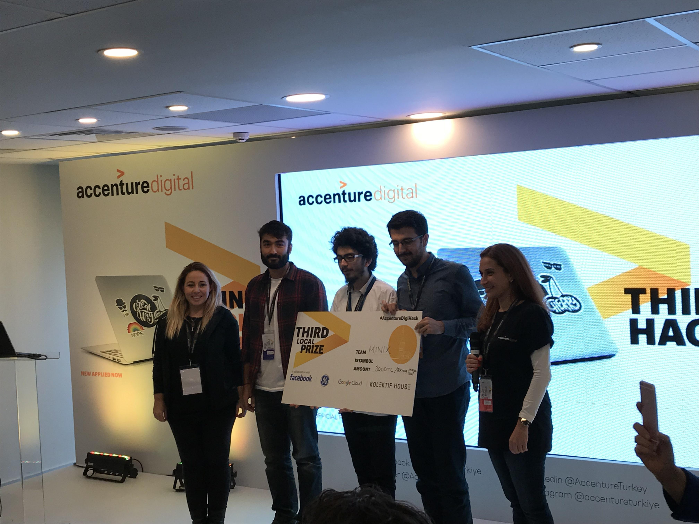

# Accenture Digital Hackathon İstanbul 2017 

We are MINIX

* [@kemaltulum](https://github.com/kemaltulum) 
* [@nazmicancalik](https://github.com/nazmicancalik)
* [@pxfurkanenes](https://github.com/pxfurkanenes)

## Our Project: Unwasted

**Unwasted**: A gamified mobile service that utilizes students' data and preferences around food choices, campus presence and eating habits to optimize catering firms' food production operations.

We have designed a web application live [here](https://accenturehackathon-8566d.firebaseapp.com/)

### You can watch our exhibitions and download presentation

#### [Exhibition A](./presentation/mobile-app.mp4)
This is our web application with its features

#### [Exhibition B](./presentation/company_part.mp4)
This is the dashboard developed to be used by catering firms

#### [Our Presentation](./presentation/Unwasted_Hackathon_Sunumu.pptx)
You can download it to learn more about our project

### We got the third place in the hackathon

#### Thanks to Accenture for this great organization

# Project Details
This project was generated with [Angular CLI](https://github.com/angular/angular-cli) version 1.5.0.

## Development server

Run `ng serve` for a dev server. Navigate to `http://localhost:4200/`. The app will automatically reload if you change any of the source files.

## Code scaffolding

Run `ng generate component component-name` to generate a new component. You can also use `ng generate directive|pipe|service|class|guard|interface|enum|module`.

## Build

Run `ng build` to build the project. The build artifacts will be stored in the `dist/` directory. Use the `-prod` flag for a production build.

## Further help

To get more help on the Angular CLI use `ng help` or go check out the [Angular CLI README](https://github.com/angular/angular-cli/blob/master/README.md).
# accentureHackathon
